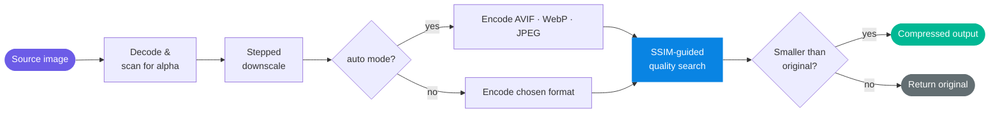

<div align="center">

<a href="https://lessbytes.vercel.app"></a>

# Lessbytes

**Image compression that converges on visually lossless, not just "quality 80".**

<p>
  
  
  
  
</p>

</div>

---

Most compressors give you a quality slider and make you guess. That's the wrong abstraction. The "right" quality setting changes with every image — a flat UI screenshot and a portrait photograph have completely different thresholds for visible degradation. Hardcoding `quality: 80` is fine until someone notices.

lessbytes treats quality as a search problem, not a config value. You declare a perceptual target; it binary-searches the quality space, encodes, decodes, measures [SSIM](https://en.wikipedia.org/wiki/Structural_similarity) against the original, and converges — in seven iterations — on the smallest file that still looks identical to the human eye.

---

## What it actually does differently

| | Fixed-quality compression | lessbytes |
|---|---|---|
| Quality decision | You guess upfront | Per-image binary search |
| Measurement | None — you eyeball the output | SSIM delta against the original |
| Format | Whatever you specified | AVIF, WebP, JPEG encoded in parallel; winner by size |
| Portrait / high-frequency detail | May degrade visibly | Holds quality where the perceptual cost is high |
| Flat illustration / solid fills | Wastes bytes on invisible headroom | Strips what the eye can't distinguish |
| Typical result | Smaller, sometimes ugly | **~84% smaller, looks identical** |

> Concrete data point from the test suite: `235 KB JPEG → 37 KB WebP` at SSIM 0.992 — the empirically-tuned threshold for photographic losslessness.

---

## Supported formats

JPEG · PNG · WebP · AVIF — with runtime feature detection so AVIF is only used when the encoder is actually available.

---

## The pipeline

Five stages. The interesting one is stage four.



**The search.** Each iteration: encode at candidate quality → decode back to pixel data → compute SSIM against the original. If it passes, push the quality lower; if not, back off. Seven iterations are enough to converge within 1% quality resolution. No heuristics, no lookup tables — just feedback.

**Downscaling.** Instead of a single bilinear pass (which introduces ringing), lessbytes steps down in stages. Slower, but meaningfully better at preserving fine detail at target dimensions.

**Format competition.** In `auto` mode all viable formats are encoded in parallel. The smallest one that meets the SSIM threshold ships. You don't pick; the math does.

**SSIM, to calibrate your expectations:**

| Score | Meaning |
|:---:|:---|
| 1.000 | Bit-for-bit identical |
| ≥ 0.998 | Below human perceptual threshold |
| ~0.970 | Subtle, only visible on direct comparison |
| < 0.950 | Clearly degraded |

The default target is **0.992** — chosen empirically against a diverse photo set to be the lowest value where no degradation is visible without a side-by-side diff.

---

## Install

```bash
npm install lessbytes
```

Or directly in the browser — no build step, no bundler, nothing to audit:

```html
<script src="https://unpkg.com/lessbytes"></script>
<script>
  lessbytes.compress(file).then(r => console.log(`${(r.ratio * 100).toFixed(1)}% smaller`));
</script>
```

---

## API

### `compress(input, options?) → Promise<CompressResult>`

`input`: `File` | `Blob` | `HTMLImageElement` | URL string.

```ts
const result = await compress(file, {
  format: 'auto',        // 'auto' | 'jpeg' | 'webp' | 'png' | 'avif'
  targetSSIM: 0.992,     // raise for more fidelity; lower to push smaller
  maxWidth: 1920,        // aspect ratio preserved
  maxHeight: null,
  targetSize: 100 * 1024, // hard ceiling in bytes — useful for upload quotas
  background: '#ffffff', // fill used when flattening alpha into a lossy format
  keepSmallest: true     // returns original if compression would make it larger
});

result.blob     // Blob — the output
result.format   // 'webp'
result.ssim     // 0.9924
result.ratio    // 0.84   (84% smaller)
result.quality  // 0.93   (the quality the search converged on)
result.toFile('upload.webp') // wraps blob as a File
```

A realistic upload handler:

```ts
input.addEventListener('change', async () => {
  const { blob, toFile } = await compress(input.files[0], { maxWidth: 1920 });
  preview.src = URL.createObjectURL(blob);
  formData.append('photo', toFile('photo.webp'));
});
```

### `compressBatch(inputs, options?) → Promise<CompressResult[]>`

Bounded concurrency and a progress callback — useful when you're processing an album or a drag-and-drop selection rather than a single file.

```ts
const results = await compressBatch(files, {
  concurrency: 3,
  maxWidth: 1600,
  onProgress: (done, total, last) => {
    console.log(`${done}/${total} — last: ${(last.ratio * 100).toFixed(0)}% smaller`);
  }
});
```

### `computeSSIM(a: ImageData, b: ImageData) → number`

The same SSIM implementation the search loop uses, exposed directly. Both buffers must be the same dimensions. Useful if you want to validate compression quality in your own pipeline without going through `compress`.

### `isFormatSupported(mime: string) → boolean`

Checks whether the browser can **encode** (not just decode) a given mime type. lessbytes uses this internally before attempting AVIF; you can use it to gate UI options.

---

## CLI

The CLI uses [`sharp`](https://sharp.pixelplumbing.com) (libvips) under the hood — the Canvas API isn't available in Node, and sharp is genuinely fast. It's an optional peer dependency: the browser bundle has no knowledge of it.

```bash
npx lessbytes photo.jpg                   # → photo.min.webp, written beside the source
npx lessbytes ./assets -r -o build/img    # recurse into a directory
npx lessbytes *.png --format webp -o out/
npx lessbytes banner.jpg --max-size 100kb
npx lessbytes huge.jpg --max-width 1920
```

Output for a single file:

```
lessbytes v1.0.0  compressing 1 image
  ✓ photo.jpg   235.8 KB → 36.9 KB   -84%   webp q93   ssim 0.992

Done. 235.8 KB → 36.9 KB  (84.4% smaller)
```

<details>
<summary>All CLI flags</summary>

<br>

| Flag | Description | Default |
|---|---|---|
| `-o, --output <path>` | Output file or directory | `*.min.*` beside source |
| `-f, --format <fmt>` | `auto` · `jpeg` · `webp` · `png` · `avif` | `auto` |
| `-q, --quality <1-100>` | Force a fixed quality — skips the search | — |
| `--max-size <size>` | Hard size ceiling, e.g. `100kb`, `1.5mb` | — |
| `--max-width <px>` | Cap output width, aspect ratio preserved | — |
| `--max-height <px>` | Cap output height, aspect ratio preserved | — |
| `--ssim <0-1>` | SSIM target for the quality search | `0.992` |
| `-r, --recursive` | Recurse into subdirectories | off |
| `--suffix <str>` | Suffix appended for in-place output | `.min` |
| `--keep-larger` | Write output even if it exceeds source size | off |
| `-s, --silent` | Suppress output except errors | off |

</details>

---

## Compatibility

**Browser:** anything with Canvas and `toBlob` — which is every browser released in the last several years. AVIF encoding is checked at runtime via `isFormatSupported` and falls back to WebP; JPEG is the universal fallback. WebP encoding covers ~97% of active browser installs.

**Node:** 16+ for the CLI. The browser library has no Node dependency.

**Bundlers:** ships ESM, CommonJS, and UMD. Tree-shakeable. Vite, webpack, Rollup, esbuild, and plain `<script>` all work without configuration.

---

## Notes on the approach

A few decisions that are worth being explicit about:

**Why binary search and not a perceptual codec?** Libraries like `squoosh` use encoder-side perceptual optimization (e.g. butteraugli for WebP/AVIF). That's more accurate but requires WebAssembly and a significant bundle. lessbytes's SSIM search is a good approximation that runs entirely on Canvas — no Wasm, no build-time dependencies, auditable in an afternoon.

**Why 0.992 as the default?** It's not arbitrary. Running the search against a diverse set of photographs and illustrations, 0.992 is consistently below the threshold where any tester flagged visible degradation in A/B comparison. Going lower occasionally produces subtle banding on portraits; going higher costs disproportionately more bytes for imperceptible gain.

**Why return the original when compression would make it larger?** Because the right behavior for a library called by an upload handler is to transparently degrade. A 9 KB PNG does not benefit from WebP encoding — lessbytes hands it back unchanged rather than making you handle that case.

---

<div align="center">

Built by **[Dev](https://devchauhan.in)**

*Compression should be measured, not guessed.*

</div>